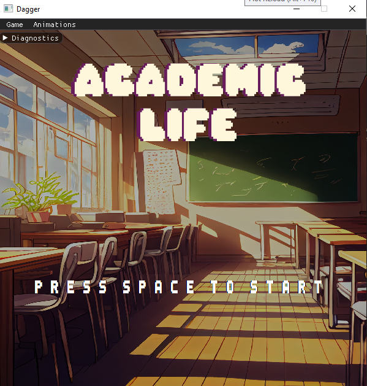
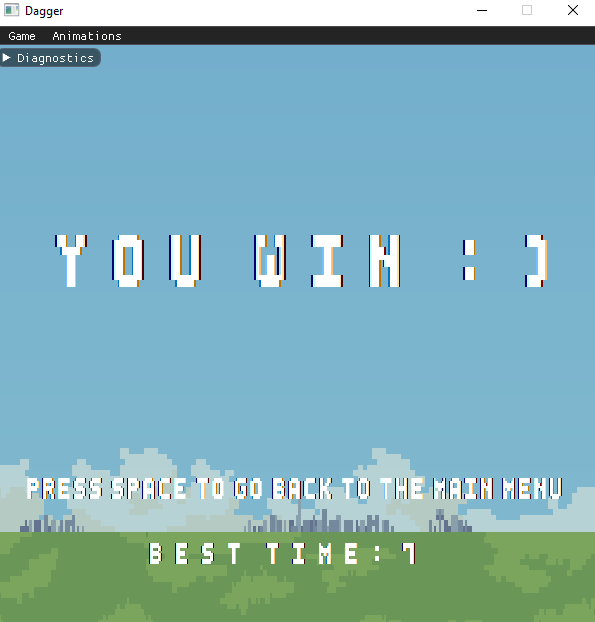
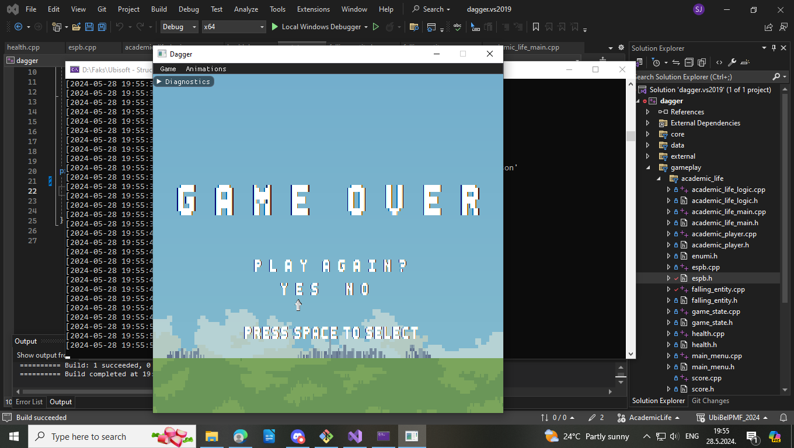

# Academic life

University course project at Faculty of Mathematics, University of Belgrade.  
The goal of this simple 2D game is to collect 240 ECTS/ESPB as fast as possible. while maintaining the health value over -100.  
If player's health drops below -100 or if the number of ECTS/ESPB is below 0 the game ends with a failure.  
Otherwise, the current best completion time is presented.  

[Demo video](https://youtu.be/szyQd7_3XbI)

## Falling entities

There are two types of entities that you need to be aware of.   
First are the equations which can alter the value of ECTS/ESPB, depending on their solution.  
Equation difficulty depends on the range of ECTS/ESPB :  
- Easy : Between 0 and 60 - operators can be +, -
- Medium : Between 60 and 120 - operators can be *, /, -
- Hard : Between 120 and 240 - operaors can be *, /, ^

The second type is auxilary lifestyle entities which can be divided into:  
- Positive : They increase the value of health
- Negative : They decrease the value of health

## Screenshots

  
  
  
  

## Authors
[Vukašin Marković](https://github.com/sntntn)   
[Marko Nikitović](https://github.com/shotinform)   
[Stefan Jevtić](https://github.com/StefanJevtic63)   
[Anja Cvetković](https://github.com/AnjaCvetkovic25)   
[Andjelija Vasiljević](https://github.com/skiiszn)       

# Dagger

A fully-featured, modern game engine made for educational purposes.

## Features

- Dagger is data-driven and event-based.
- Dagger is extremely modular.
- Dagger is clear and clearly educational.

## Setting up the development environment

- [Windows](docs/setting_up_windows.md)
- [Linux](docs/setting_up_linux.md)
- Mac (WIP)

## Resources

Any kind of data used by engine that is not source code is considered a resource. Root directory for resources is `data\`
and so all references to resoruces begin there. For example, if you want to get a texture (from `data\textures`) you would
use `textures\mytexture.png` instead `data\textures\mytexture.png`.

## Rights and Reservations

Dagger is made as a part of Ubisoft Belgrade's game development course. All rights reserved.
